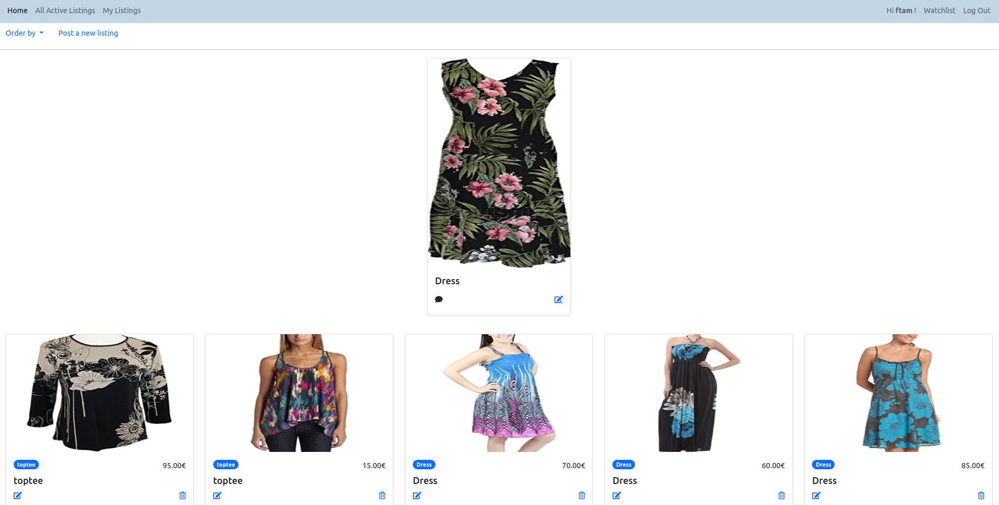
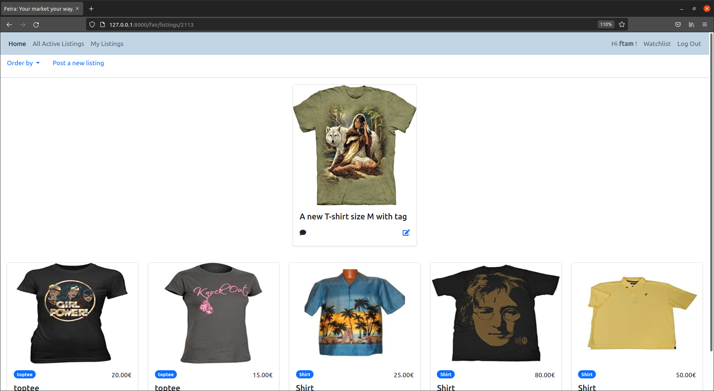
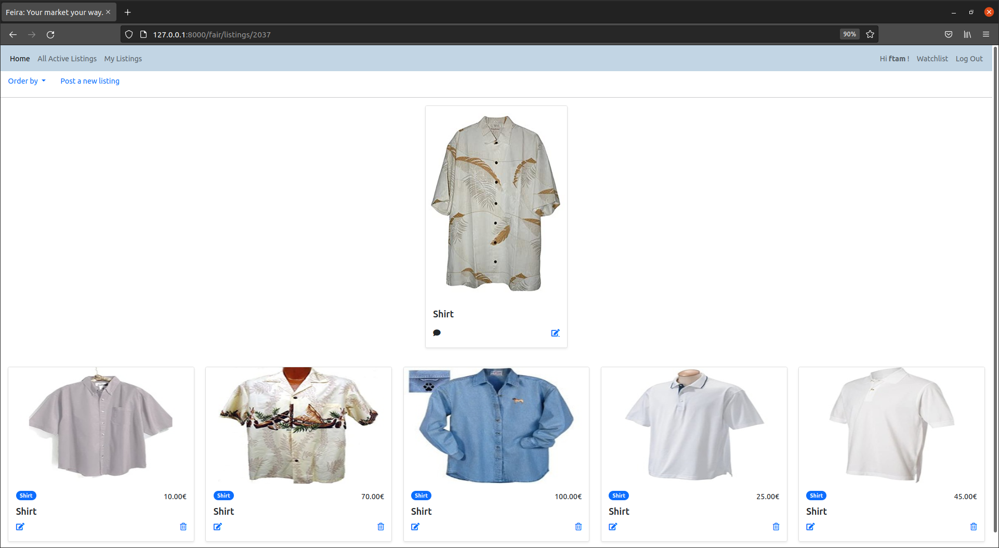
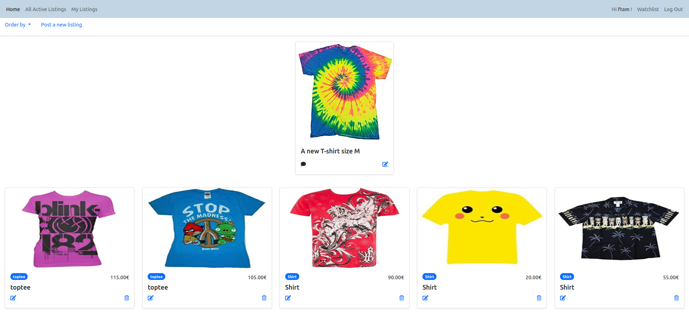

# Feira

A Marketplace powered by machine learning backend services.

Main requirements:
- Python 
- Pytorch
- Django
- SQLite
- Javascript
- HTML 5
- Bootstrap 5

See requirements for a full **conda** environnement setup.

  
   <b> Marketplace </b>

## Current apps:
Feira currently supports two main applications:
 - **Fair**: where users can list their items and view other's. 
 - **Accounts**: a typical django app for account management

> Note: more apps will be added to the project with more machine learning support in the next few sprints.

### Fair:
 Currently, Fair is the core of the marketplace. It allows users to post their listings. In the current version, no actual buying functionalities are added but they are in the backlog and will be added in the in the next sprints. The of focus of the last sprint was establishing various functionalities like ML support, encryption, security, and auditing. More features and analysis will be added like throttling a flood of requests, advanced encryptions, optimization, more complex ML support, and more tests especially in the frontend.

 The summary of the some features in the next few sprints include:
 - adding actual buying functionalities
 - performance analysis and traffic optimization
 - customer segmentation and advanced ML services
 - adding more security and permission features
 - more lightweight features, like sharing, rating, ...
 - More API services will be added to support field updating and simple queries.
 - Improving the GUI and add more panels
  

 Looking at the current system, we can easily see the recommendation backend is working quite nice. Here are some examples:

> Note: Many items are generated automatically to populate the system. Therefore, some prices are not realistic. But the actually system is working fine.

> Note: The current recommendation system uses the images only. A hybrid architecture will be developed to include both image, text, and other data types for a more accurate recommendations.

  

  

  

   

  

  

  

  

  

  

### Recommendations:
The ML backend is quite simple and fast. It uses a pre-trained ***resnet50*** network to extract features and compare them using a similarity metric.

To avoid running the ML every time the user navigates an item. We can run the ML on all items only once. The similarity matrix between all items is calculated only once and whenever the user chooses an item, the system uses a traditional django ORM lookup to show recommendations.

### Security:
The current system has some essential features. These include: auditing, encrypted fields, CSRF tokenization, delete-restore, model and object level permissions. More features like two-factors authentication will be added to some apps.

### Tests:
Some essentials tests were conducted to ensure the system is working fine. These include backend tests like permission tests, CSRF tests, ....

**Summary**: 
The current version is quite simple but is working fine with all tests went ok. There are more to be added and explored, especially adding more API-support to the views and focusing more on the front-end. 