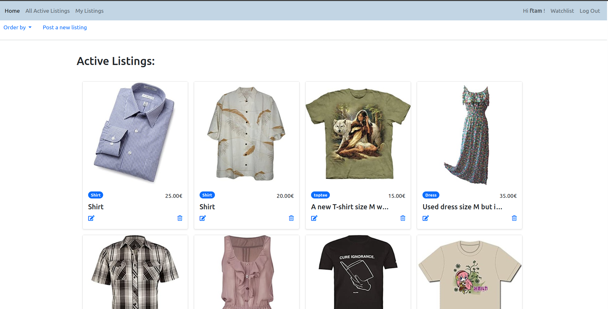
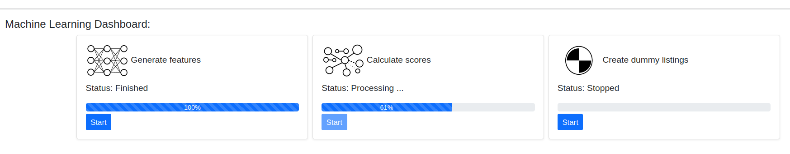
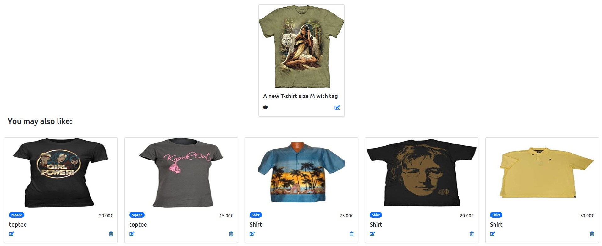

# Feira

A Marketplace powered by machine learning backend services.

Main requirements:
- Python 
- Pytorch
- Django
- Django REST Framework
- Celery
- Redis server
- SQLite
- Javascript
- HTML 5
- Bootstrap 5

**To run:** you can use the Dockerfile and start **celery** and **redis server**

```
  celery -A feira worker -l INFO
  sudo systemctl [start, stop, enable, restart] redis
```


<p align="center">
  
  <br><b> Marketplace </b>
</p>


## Current apps:
Feira currently supports two main applications:
 - **Fair**: where users can list their items for selling. 
 - **Accounts**: a typical app for account management

> Note: more apps will be added to the project with more machine learning support in the next few sprints.

### Fair:
 Currently, Fair is the core of the marketplace. It allows users to post their listings. In the current version, no actual buying functionalities are added but they are in the backlog and will be added in the in the next sprints. The focus of the last sprint (two weeks) was establishing various functionalities like ML support, encryption, security, and auditing. In the current sprint the focus is to develop API support using *REST API* framework and to develop **Celery** tasks and use **Redis** service to deliver results. These are now available in the dashboard as shown in the next figure.

 <p align="center">
  
  <br><b> ML backend services </b>
</p>
 
 Moreover, some security tests were added.
 This sprint still in the middle and more features will be added.
 

 The summary of some features that will be added in the next few sprints include:
 - Improving the frontend and add more panels
 - adding actual buying functionalities
 - performance analysis and traffic optimization
 - customer segmentation and advanced ML services
 - adding more security and permission features
 - more lightweight features, like sharing, rating, ...


 Looking at the current version, we can easily see the recommendation backend is working quite nice. Here are some examples:

> Note: Many items are generated automatically to populate the system. Therefore, some prices are not realistic :)


> Note: The current recommendation system uses the images only. A hybrid architecture will be developed to include both image, text, and other data types for a better accurate predictions.

<p align="center">
  
</p>

<p align="center">
  
</p>

<p align="center">
  
</p>
   
<p align="center">
  
</p>

<p align="center">
  
</p>

<p align="center">
  
</p>

<p align="center">
  
</p>


### "You may also like":
In order to populate the system with data, the fashion dataset: https://github.com/XiaoxiaoGuo/fashion-iq was used to create dummy listings. This will make it reasonable to check how the system will look like in production. You can try your own settings by changing the *configurations.json* file in the *fair* app. This can be done via the dashboard **create dummy listing** service (see Dashboard above).

The ML backend is quite simple and fast. It uses a pre-trained ***resnet50*** network to extract features and compare them using a similarity metric.

To avoid running the ML service every time the user navigates an item, which is not practical nor necessary, we can run the ML on all items only once. The similarity matrix between all items is calculated and whenever the user chooses an item, the system uses a simple and clean django ORM lookup to show recommendations. This separation reduces dependencies between django and ML libs and make future extensions (e.g. a more robust recommendation ML) easy to add. However, for some other ML services this is not possible and API-based interaction will be used.

The similarity matrix, will be updated once new items are posted on the systems. One way to do it would be to run a background service after the post-saving signal. However, that might lead to a racing-condition between ML and db engines and would require proper synchronization and locking. Another efficient and simple approach is to update them using an explicit command that takes care of the system existing state and ensure data integrity pre-during- and-post update. This can be done in the dashboard (see Figure above).

### Security:
The current system has some essential features like auditing, encrypted fields, CSRF tokenization, delete-restore, model and object level permissions. More features like two-factors authentication will be added to some apps.


### Tests:
Some essentials tests were conducted to ensure the system is working fine. These include backend tests like permission tests, CSRF tests, ....


### Summary:
The current version is quite simple but is working fine with all tests went OK. There are more to be added and explored, especially adding more API-support to the views and focusing more on the front-end. 